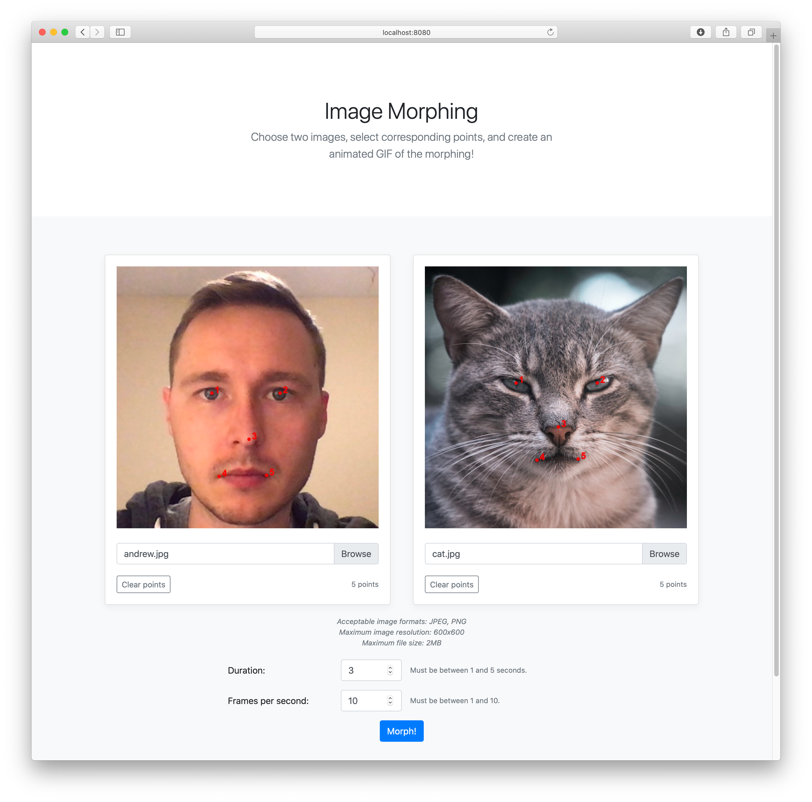
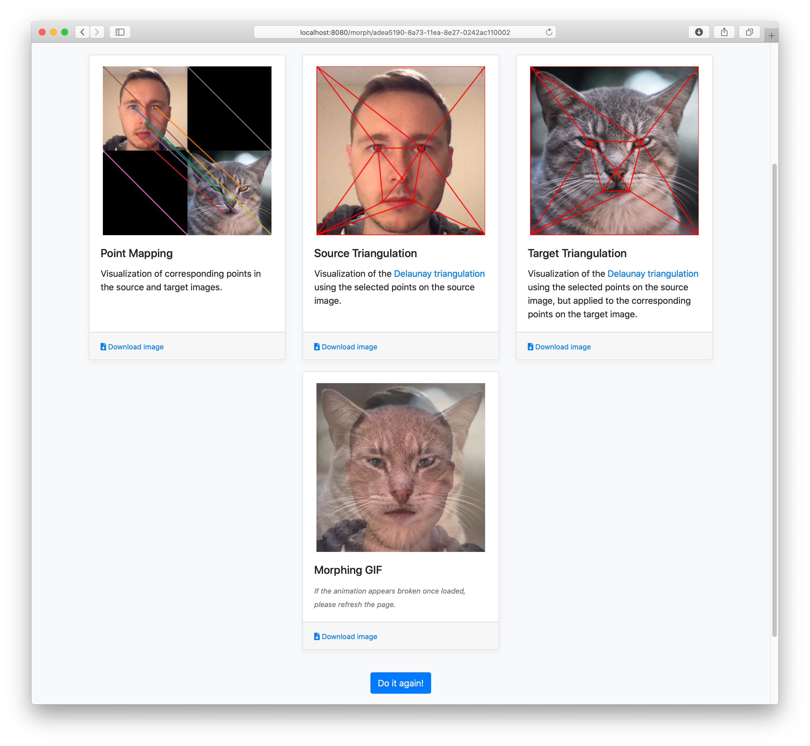

# image-morphing

[](https://travis-ci.com/avojak/image-morphing)

Implementation of image morphing with a web front-end. Images are uploaded, 
and the user selects corresponding points in the images.

Demo video: https://www.youtube.com/watch?v=S3hfBqrwQms





This was created for the CS 445 Spring 2020 Final Project at the University of Illinois at Urbana-Champaign.
There are plenty of things that could be better but it works, and again this was for a school project!

## Building

Install the following pre-requisite software:

* Python 3
* Docker (only if building the Docker image)
* ImageMagick (only if running the test server locally)

### Building the Python Packages

To build only the Python packages:

```bash
$ pip install -r requirements.txt
$ make lib web
```

### Building the Docker Image (Recommended)

To build the Docker image:

```bash
$ make image
```

To build everything:

```bash
$ make all
```

Note that building all only makes sense if you intend to consume the Python packages directly. Otherwise simply
building the Docker image will produce a portable distribution.

## Running

### Test Server

To run locally for testing:

```bash
$ export FLASK_APP=webmorphing; flask run
```

The UI will be available at [http://localhost:5000](http://localhost:5000).

### Docker Image

A Docker image is also produced and can be run with the following command:

```bash
$ docker run -it -p 8080:8080 avojak/image-morphing:{version}
```

The UI will be available at [http://localhost:8080](http://localhost:8080).

## Example Results


## Technologies Used

* [OpenCV](https://pypi.org/project/opencv-python/) - Image IO, computing affine transformations
* [Scipy](https://pypi.org/project/scipy/) - Computing Delaunay triangulations
* [Matplotlib](https://pypi.org/project/matplotlib/) - Creating plots
* [ImageMagick](http://www.imagemagick.org) - Producing the animated GIF
* [Flask](https://pypi.org/project/Flask/) - Web server
* [Bootstrap](https://getbootstrap.com) - Making a half-decent looking UI
* [Docker](https://www.docker.com) - Portable distribution

## Attribution

* Cat: [Matthew Kerslake](https://unsplash.com/@mattkerslake?utm_source=unsplash&utm_medium=referral&utm_content=creditCopyText) on [Unsplash](https://unsplash.com/s/photos/cat?utm_source=unsplash&utm_medium=referral&utm_content=creditCopyText)
* Young Anakin: [Comic Vine](https://comicvine1.cbsistatic.com/uploads/original/11125/111250671/4775035-a1.jpg)
* Old Anakin: [Fandom](https://vignette.wikia.nocookie.net/swfanon/images/8/89/AnakinEstGrumpy.jpg/revision/latest/top-crop/width/360/height/450?cb=20120219201211)
* Darth Vader: [BGR](https://boygeniusreport.files.wordpress.com/2015/08/darth-vader.jpg?quality=98&strip=all)